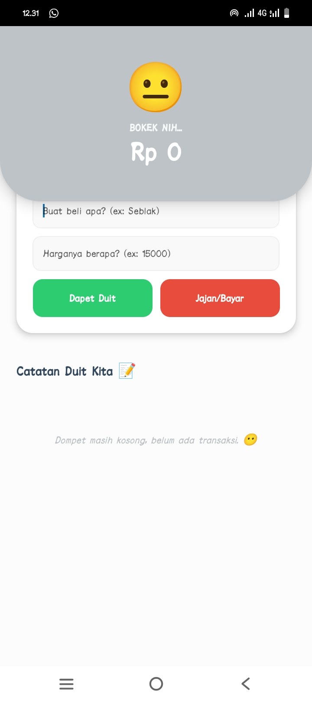
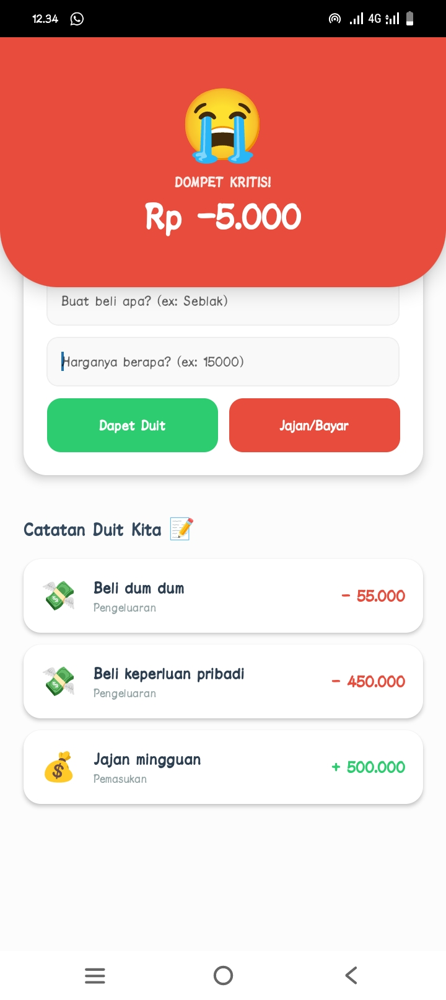

# Dompetku App - Pemrograman Mobile UTS 

## Nama & NIM
- Nama: [Stephani della christin zai]
- NIM:  [243303621228]

## Screenshot
### Tampilan Utama 

### Tampilan saat saldo masuk

### Tampilan saldo aman

### Tampilan saldo krisis

## Cara Menjalankan
1. Clone repo  : git clone [https://github.com/stephani689/DOMPETKU]
2. Install deps: npm install
3. Jalankan    : npx expo start
4. Scan QR Code dengan Expo Go di HP

## link snack
[https://snack.expo.dev/@stephanizz/dompetkuu]
